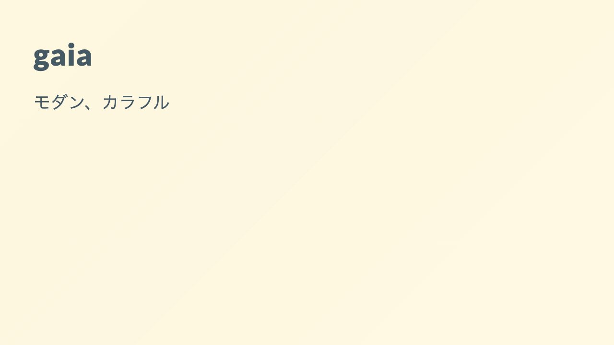

<style scoped>
section {
  display: flex;
  flex-direction: column;
  justify-content: center;
}
</style>


# Marp入門

**生成AIと作る新時代のスライド**

toku345

---

<!-- _class: lead -->

## スライド作成、面倒じゃないですか？

- PowerPointを開くのが億劫
- デザイン調整に時間を取られる
- Gitで差分管理できない
- 生成AIに頼りづらい

---

## Marpとは

**Markdown → スライド変換ツール**

| 従来の悩み | Marp なら |
| ------------ | ----------- |
| PowerPointを開くのが億劫 | エディタで即執筆 |
| デザイン調整に時間が溶ける | テーマを選ぶだけ |
| Gitで差分管理できない | 完全バージョン管理 |
| 生成AIに頼りづらい | Claude Code にお任せ！ |

---

<!-- _class: lead -->

## エディタで即執筆

アプリ不要、Markdownを書くだけ

---

## Markdownで書くだけ

```markdown
# スライドタイトル

- 箇条書きで
- サクサク書ける

---

# 次のスライド
```

**`---` で区切るだけでスライド完成**

---

<!-- _class: lead -->

## デザインはMarpにお任せ

テーマ / クラス / 背景で自由自在

---

## 組み込みテーマ（3種類）

  

このスライドは gaia

---

<!-- _class: lead -->

# lead クラス

`<!-- _class: lead -->` で中央揃え

---

<!-- _class: invert -->
<!-- _backgroundColor: #2d3436 -->

# invert クラス

`<!-- _class: invert -->` で色反転

---

<!-- _backgroundImage: url('https://marp.app/assets/hero-background.svg') -->

## 背景画像（全体背景）

**backgroundImage ディレクティブで背景を設定**

`<!-- _backgroundImage: url('image.svg') -->`

---

## 背景画像（分割レイアウト）


``

- `right` / `left` で配置を指定
- パーセントで幅を調整

---

## 高度な機能（HTML + CSS）

<style scoped>
.highlight { background: linear-gradient(transparent 60%, #ffeb3b 60%); }
</style>

<div style="display: grid; grid-template-columns: 1fr 1fr; gap: 2rem;">

<div>

### 2カラムレイアウト

- HTML + CSSで自由配置
- 比較表示に最適

</div>

<div>

### CSS装飾

- <span class="highlight">マーカー風ハイライト</span>
- サイズ・色の変更も自在

</div>

</div>

---

<!-- _class: lead -->

## Gitで完全バージョン管理

Markdownだからdiffが読める

---

## Gitで差分管理

```diff
- ## 古いタイトル
+ ## 新しいタイトル

- 修正前のテキスト
+ 修正後のテキスト
```

- 変更点が一目瞭然
- PRでレビュー可能
- 履歴を追跡できる

---

<!-- _class: lead -->

## Claude Codeにお任せ

Markdownだから生成AIと相性抜群

---

## Claude Codeで爆速作成

**「こんなスライド作って」で即生成**

- スライド構成の提案
- コンテンツの自動生成
- デザイン調整もお手のもの

**実はこのスライドも Claude Code で作成**

---

## 今日から始めるなら

### インストール不要で試す

```bash
npx @marp-team/marp-cli@latest slide.md -o output.html
```

### VS Code派なら

1. 「**Marp for VS Code**」拡張をインストール
2. `.md` ファイルを作成
3. プレビューを開く

---

<!-- _class: lead -->


## Markdownが書けるなら
## もうスライドは作れる

**公式サイト**: https://marp.app/
